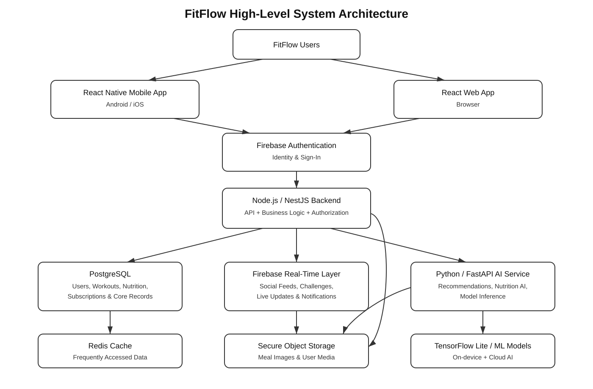

# FitFlow Redesign

**IT3060 – Human Computer Interaction | Lab Exercise 05 | Semester 2, 2026**

FitFlow Redesign is a cross-platform fitness application concept focused on personalized workouts,
simplified nutrition tracking, social motivation, progress monitoring, and AI-powered recommendations.

## Core Features

- AI-powered personalized workout plans
- Workout tracking and progress dashboards
- Camera-assisted nutrition tracking
- Social/community interactions and challenges
- Real-time notifications and synchronization
- Secure user authentication and privacy controls
- Web, Android, and iOS access

## Recommended Technology Stack

| Layer | Selected Technology |
|---|---|
| Mobile Application | React Native + TypeScript |
| Web Interface | React + TypeScript |
| Main Backend | Node.js + NestJS |
| AI Service | Python + FastAPI |
| Primary Database | PostgreSQL |
| Real-Time Layer | Firebase / Firestore or Realtime Database |
| Authentication | Firebase Authentication |
| Caching | Redis |
| On-Device AI | TensorFlow Lite / suitable device ML framework |
| File/Image Storage | Secure cloud object storage |
| API Style | REST + WebSocket/Firebase events where required |
| Deployment | Containerized cloud deployment with CI/CD |

## Repository Structure

```text
fitflow-redesign/
├── frontend/
│   ├── mobile/
│   └── web/
├── backend/
│   ├── src/
│   └── test/
├── ai-service/
│   ├── app/
│   ├── models/
│   └── tests/
├── database/
│   ├── migrations/
│   └── schema/
├── docs/
│   ├── tech-stack-summary.md
│   ├── technology-comparison.md
│   ├── decision-matrix.md
│   ├── architecture.md
│   ├── ADR-001.md
│   ├── repository-settings.md
│   ├── SUBMISSION_CHECKLIST.md
│   └── fitflow-architecture.svg
├── .github/
│   └── workflows/
│       └── repository-check.yml
├── .env.example
├── .gitignore
├── LICENSE
└── README.md
```

## Architecture



The mobile and web clients authenticate using Firebase Authentication and communicate securely
with the NestJS backend. PostgreSQL stores authoritative structured application data. Firebase
supports selected real-time social features and synchronization. FastAPI hosts AI workloads,
Redis caches frequently used data, and media is stored in secure object storage.

## Documentation

- [Technology Stack Summary](docs/tech-stack-summary.md)
- [Technology Comparison](docs/technology-comparison.md)
- [Weighted Decision Matrix](docs/decision-matrix.md)
- [High-Level Architecture](docs/architecture.md)
- [Architecture Decision Record](docs/ADR-001.md)
- [Repository Settings Guide](docs/repository-settings.md)
- [Submission Checklist](docs/SUBMISSION_CHECKLIST.md)

## Course

- Module: IT3060 – Human Computer Interaction
- Lab: Lab Exercise 05
- Project: FitFlow Redesign

> After creating the GitHub repository, replace any repository-link placeholder in the lab report
> with the actual GitHub URL.
